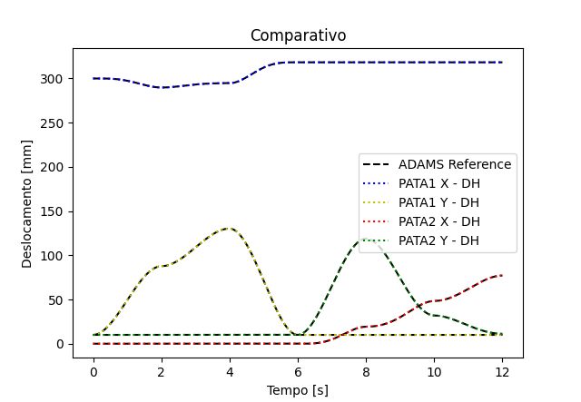

<h4 align="center"> 
   
    
   
   
   
   
</h4>

  

---
# Kinematic Analysis

This repository is dedicated to the kinematic analysis of a robot, specifically an inchworm-type robot. The project involves analytical modeling, simulation, and comparison with ADAMS (Automatic Dynamic Analysis of Mechanical Systems) to validate the results. The repository is currently under construction, and contributions are welcome!

## Project Overview

### Inchworm Robot Configuration

The inchworm robot is a bio-inspired robot designed to mimic the movement of an inchworm. It uses a series of contractions and extensions to traverse surfaces, making it suitable for applications in confined spaces or uneven terrains.

### Analytical vs. ADAMS Comparison

The project includes a detailed comparison between analytical methods and ADAMS simulations to validate the kinematic analysis. This ensures the accuracy and reliability of the robot's motion.

  

### Steps and Graphs

The repository contains graphs to illustrate the analysis process, including the results from both analytical and ADAMS simulations.

### 2 Steps

  

---
